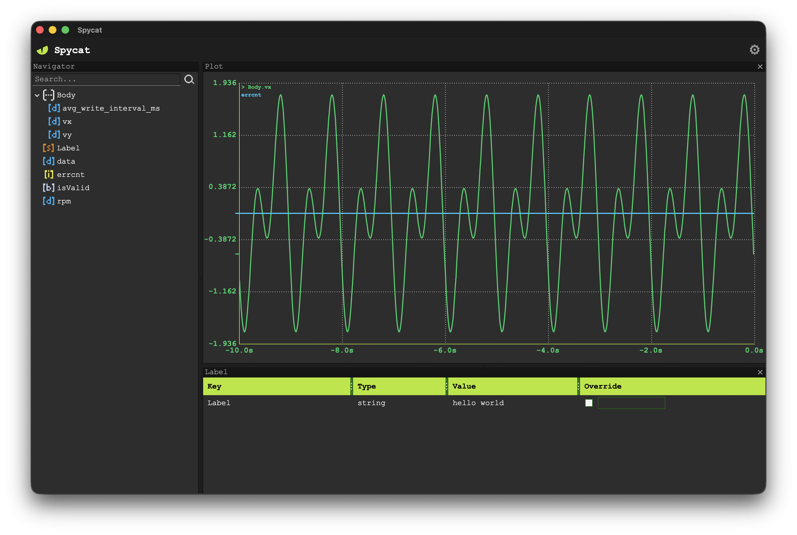

<div align="center">

# Spycat

**An oscilloscope for running software.**

Live introspection and override for C++ applications — without stopping execution.



</div>

---

## What is Spycat?

Spycat lets you inspect and override the internal state of a live program in real time, without stopping it. Plot continuously changing variables — sensor inputs, PID gains, motor current, particle counts, training loss — on a scrolling time axis. Override any variable with a custom value to test edge cases, tune parameters, or force failure modes.

Existing tools force a choice: print statements are too slow, debuggers halt the program, and dashboards like Grafana and Prometheus are built for servers, not real-time engineering systems. Spycat fills the gap for robotics, control systems, embedded software, physics simulations, game engines, and ML pipelines.

## Architecture

Spycat ships as three components:

```
┌──────────────────┐         ┌──────────────────┐
│   Your Program   │         │     Spyscope     │
│  (Spycat SDK)    │ ──────► │  (Desktop UI)    │
│                  │  shmem  │                  │
└──────────────────┘         └──────────────────┘
```

- **Spycat SDK (`spymap_lib`)** — C++ static library you link into your program. Writes typed values to a shared-memory dictionary.
- **Spyscope** — Cross-platform wxWidgets desktop UI for browsing, plotting, watching, and overriding live values.

## Quickstart

```cpp
#include "spymap.hpp"

int main() {
    spycat::Spymap map("my_app");      // open or create a named segment

    double rpm = 0.0;
    while (running) {
        rpm = read_sensor();
        map.set("Engine.Cylinder.RPM", rpm);   // appears live in Spyscope
        // ...
    }
}
```

Launch Spyscope, point it at the segment name `my_app`, and the variable appears in the navigator. Drag it onto the plot pane to see it scroll in real time.

## Features

### Data transport — Spymap

- Shared-memory IPC via Boost.Interprocess — zero network, zero broker
- Typed key/value store: `double`, `float`, `int64`, `int32`, `bool`, `string`, raw bytes
- Non-blocking mutex (`try_to_lock`) — the UI never freezes if a producer crashes
- Override/injection system — any key can be force-set at higher priority, overriding the producer's writes
- Named segments — multiple independent apps can coexist on one machine

### Navigator panel

- Hierarchical tree built from dotted key names (`Engine.Cylinder.RPM` becomes namespace nodes plus a leaf)
- Per-type icons for namespace, double, float, int32, int64, bool, string, and raw
- Live updates — new keys appear automatically as producers write them
- Case-insensitive substring search with live filtering
- Multi-select keys or whole namespaces
- Drag-and-drop onto plot or watch panes
- Right-click context menu to plot or watch the current selection
- Automatic reset on segment change

### Plot pane

- Real-time scrolling line plot, one or more traces per pane
- Collision-free automatic color assignment for multi-trace plots
- Drag additional keys from the navigator onto an existing plot to add traces
- Remove individual traces without rebuilding the plot
- Plot configuration persists across sessions

### Watch pane

- Table of key → live value, updated every poll tick
- Override column — check a key to inject a custom value into shared memory, overriding the producer
- Override values and checkbox state persist across sessions and are re-asserted on startup
- All overrides released cleanly on window close
- Drag to reorder rows; add or remove keys at any time
- Watch pane configuration persists across sessions

### Layout & persistence

- Full AUI docking — panes are freely dockable, floatable, and resizable
- Window size, pane positions, and pane contents saved to a single `layout.json` on close
- Segment name persists across sessions

### Settings

- Change the shared memory segment name — swaps the data source live and resets the navigator
- Clear App Data — destroys the shared memory segment with a confirmation prompt
- Version info

## Building

### Dependencies

- C++17 or newer
- CMake 3.16+
- Boost (Interprocess)
- wxWidgets 3.2+ (for Spyscope only)
- Optional: pybind11 (for Python bindings — auto-detected, skipped silently if absent)

### Build

```bash
git clone https://github.com/amaljoy2026/Spycat.git
cd Spycat
cmake -B build -DCMAKE_BUILD_TYPE=Release
cmake --build build -j
```

CMake produces three targets:

- `spymap_lib` — static library you link into your program
- `spyscope` — the GUI application

### Python bindings

If pybind11 is found at configure time, a Python module is built automatically:

```python
import spymap

m = spymap.Spymap("my_app")
m.set("Engine.RPM", 3200.0)
print(m.get("Engine.RPM"))
```

## Platform support

| Platform | Spymap | Spyscope |
|----------|--------|----------|
| Linux (x86_64, ARM64) | ✅ | ✅ |
| macOS | ✅ | ✅ |
| Windows | ✅ | ✅ |
| Embedded Linux (Raspberry Pi, Jetson) | ✅ | — |

## Use cases

- **Robotics & controls** — tune PID gains live without recompiling
- **Embedded systems** — inspect sensor values and override actuator commands during bring-up
- **Physics & engineering simulations** — watch state variables evolve, inject test conditions
- **Game engines** — debug physics, AI state, and entity counts in a running game
- **ML pipelines** — monitor training metrics and override hyperparameters mid-run

## Status

Feature-complete v1. No known bugs. Test coverage is in progress.

## License

MIT — see [LICENSE](LICENSE).

## Contact

Issues and feature requests welcome via GitHub Issues.